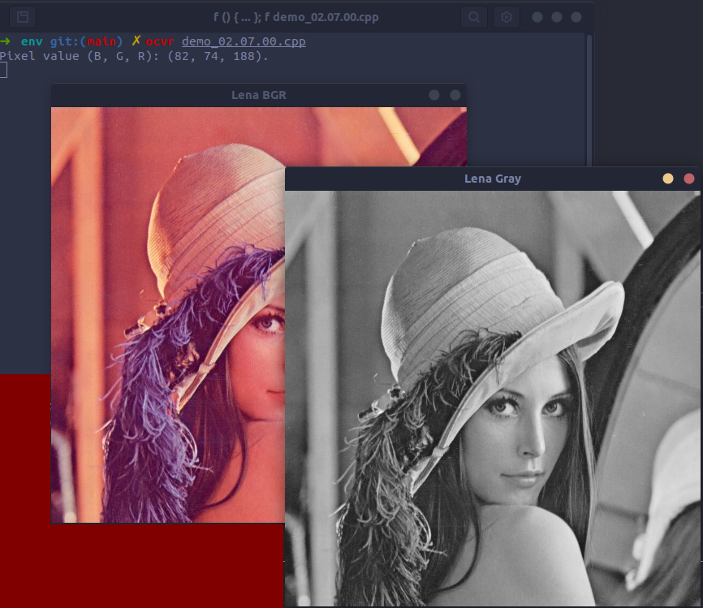

# 2.7. Reading/writing images
###### [demo_02.07.00.cpp](demo_02.07.00.cpp)
```cpp
#include <iostream>
#include <string>
#include <sstream>
using namespace std;

// OpenCV includes
#include <opencv2/core.hpp>
#include <opencv2/highgui.hpp>
using namespace cv;

int main(int argc, const char** argv) {
    Mat color = imread("./data/lena.jpg");
    Mat gray = imread("./data/lena.jpg", IMREAD_GRAYSCALE);

    // Check for invalid input
    if (!color.data) {
        cout << "Could not open or find the image." << endl;
        return -1;
    }

    // Write images
    imwrite("./data/lena_gray.jpg", gray);

    // Get same pixel with OpenCV function
    int myRow = color.cols - 1;
    int myCol = color.rows - 1;
    Vec3b pixel = color.at<Vec3b>(myRow, myCol);
    printf("Pixel value (B, G, R): (%d, %d, %d).\n", (int)pixel[0], (int)pixel[1], (int)pixel[2]);

    // Show images
    imshow("Lena BGR", color);
    imshow("Lena Gray", gray);

    // Wait for any key press
    waitKey(0);
    return 0;
}
```


# 2.8. Reading videos and cameras
