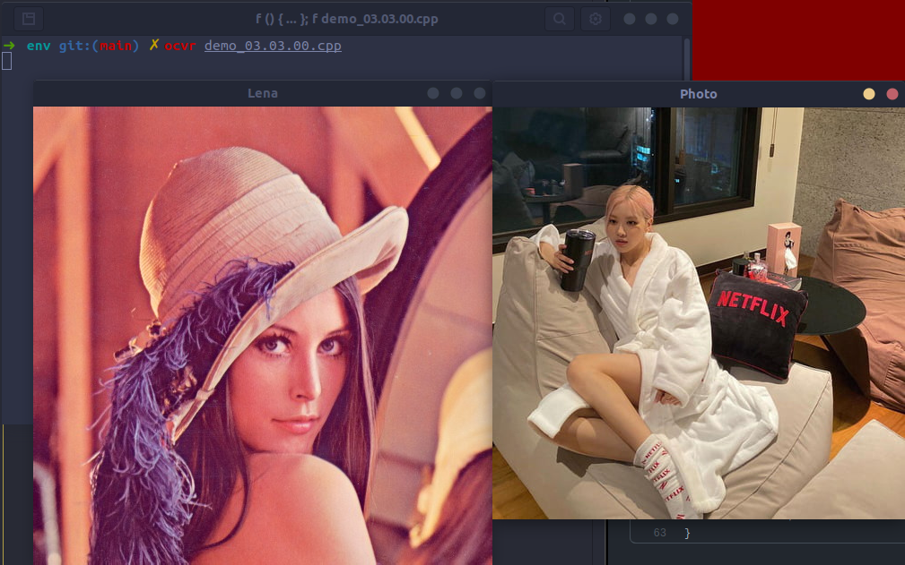
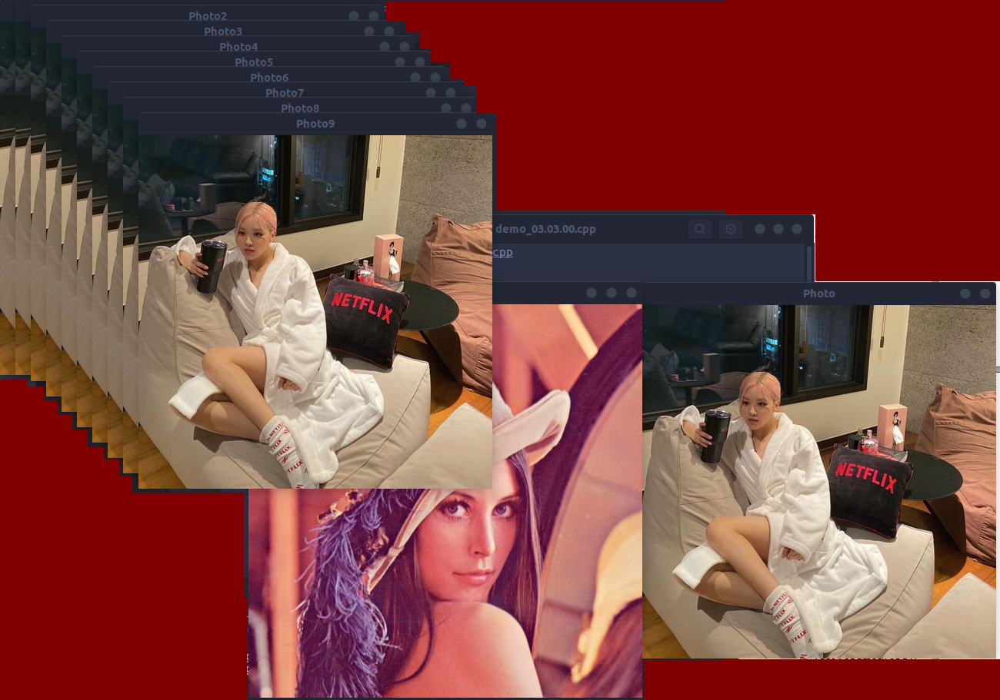
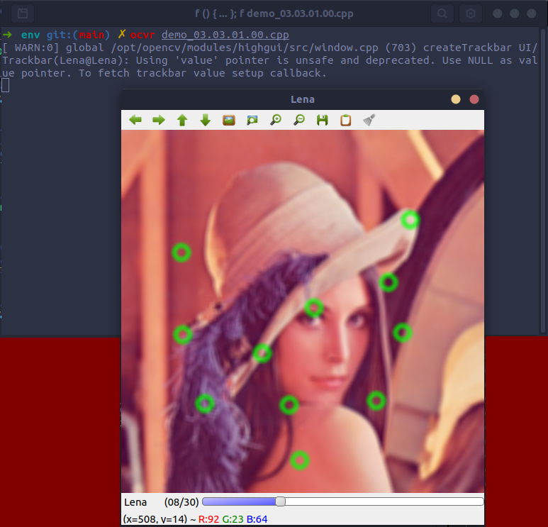
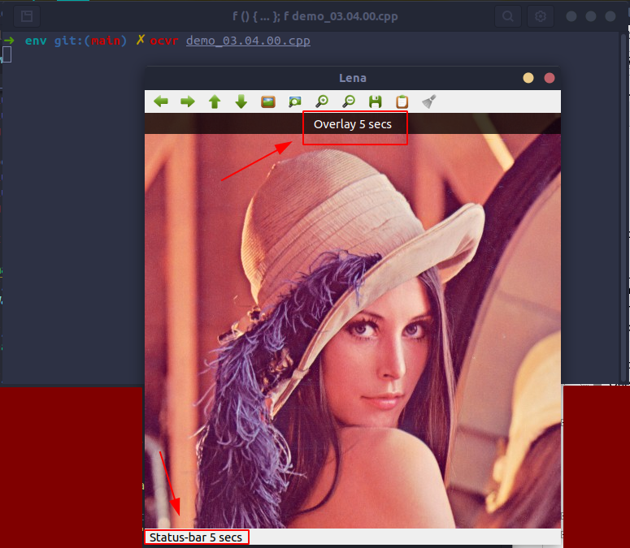

# 3.3. Basic graphical user interface with OpenCV
###### [demo_03.03.00.cpp](demo_03.03.00.cpp)
```cpp
#include <iostream>
#include <string>
#include <sstream>
using namespace std;

// OpenCV includes
#include <opencv2/core.hpp>
#include <opencv2/highgui.hpp>
using namespace cv;

const int CV_GUI_NORMAL = 0x10;

int main(int argc, const char** argv) {
    // Read images
    Mat lena = imread("./data/lena.jpg");
    Mat photo = imread("./data/photo.jpg");

    // Create windows
    namedWindow("Lena", WINDOW_NORMAL);

    // Checking it Lena image has been loaded
    if (!lena.data) {
        cout << "Lena image missing!" << endl;
        return -1;
    }

    // Create a window without resizing by cursor
    namedWindow("Photo", WINDOW_AUTOSIZE);
    if (!photo.data) {
        cout << "Photo image missing!" << endl;
        return -1;
    }

    // Move windows
    moveWindow("Lena", 10, 10);
    moveWindow("Photo", 520, 10);

    // Show images
    imshow("Lena", lena);
    imshow("Photo", photo);

    // Resize window
    resizeWindow("Lena", 512, 512);

    // Wait for any key press
    waitKey(0);

    // Create 10 windows
    for (int i = 0; i < 10; ++i) {
        ostringstream ss;
        ss << "Photo" << i;
        namedWindow(ss.str());
        moveWindow(ss.str(), 20*i, 20*i);
        imshow(ss.str(), photo);
    }

    waitKey(0);

    // Destroy all windows
    destroyAllWindows();
    return 0;
}
```
* Sau khi chạy:
  
* Sau khi press any key:
  

## 3.3.1. Adding slider and mouse events to our interfaces
###### [demo_03.03.01.00.cpp](demo_03.03.01.00.cpp)
```cpp
#include <iostream>
#include <string>
#include <sstream>
using namespace std;

// OpenCV includes
#include <opencv2/core.hpp>
#include <opencv2/highgui.hpp>
#include <opencv2/imgproc.hpp>
using namespace cv;

// Giá trị làm mờ ban đầu mặc định là 15/30, tức vị trí 15 trên slidebar
int blurAmount = 15;

// Trackbar call back function
static void onChange(int pos, void* userInput);

// Mouse callback
static void onMouse(int event, int x, int y, int, void* userInput);


int main(int argc, const char** argv) {
    // Read image
    Mat lena = imread("./data/lena.jpg");

    // Create window
    namedWindow("Lena");

    // Làm mờ hình ảnh
    createTrackbar("Lena", "Lena", &blurAmount, 30, onChange, &lena);

    setMouseCallback("Lena", onMouse, &lena);

    // Call to onChange to init
    onChange(blurAmount, &lena);

    // Wait app for a key to exit
    waitKey(0);

    // Destroy the window
    destroyWindow("Lena");

    return 0;
}

// Trackbar call back function
static void onChange(int pos, void* userInput) {
    // Kiểm tra giá trị làm mờ là bao nhiêu (ban đầu là 15)
    if (pos <= 0) return;

    // `Mat` object dùng để làm mờ
    Mat imgBlur;

    // Vì `userInput` truyền vào là ma trận, nên cần ép kiểu lại, ở đây là hình lena
    Mat* img = (Mat*)userInput;

    // Apply a blur filter
    // Tham số Size(pos, pos) tức là giá trị làm mờ dọc theo chiều ngàng và chiều dọc
    blur(*img, imgBlur, Size(pos, pos));

    // Show the result
    imshow("Lena", imgBlur);
}

// Mouse call back
static void onMouse(int event, int x, int y, int, void* userInput) {
    if (event != EVENT_LBUTTONDOWN) return;

    // Get the pointer input image
    Mat* img = (Mat*)userInput;

    // Draw circle
    // Tham số thứ 2 là trung tâm hình tròn, thứ 3 là bán kính, thứ 4 là màu, thứ 5 là độ dày đường vẽ
    circle(*img, Point(x, y), 10, Scalar(0, 255, 0), 3);

    // Call on change to get blurred image
    onChange(blurAmount, img);
}
```


# 3.4. Graphic user interface with Qt
###### [demo_03.04.00.cpp](demo_03.04.00.cpp)
```cpp
#include <iostream>
#include <string>
#include <sstream>
using namespace std;

// OpenCV includes
#include <opencv2/core.hpp>
#include <opencv2/highgui.hpp>
using namespace cv;

const int CV_GUI_NORMAL = 0x10;

int main(int argc, const char** argv) {
    // Read image
    Mat lena = imread("./data/lena.jpg");

    // Create window
    namedWindow("Lena");

    // Show image
    imshow("Lena", lena);

    // Display overlay
    displayOverlay("Lena", "Overlay 5 secs", 5000);

    // Display status bar
    displayStatusBar("Lena", "Status-bar 5 secs", 5000);

    // Save window parameters
    saveWindowParameters("Lena");

    // Load window parameters
    loadWindowParameters("Lena");

    // Wait for any key press
    waitKey(0);

    // Destroy the window
    destroyWindow("Lena");

    return 0;
}
```


## 3.4.1. Adding buttons to the user interface
###### [demo_03.04.01.00.cpp](demo_03.04.01.00.cpp)
```cpp
#include <iostream>
#include <string>
#include <sstream>
using namespace std;

// OpenCV includes
#include <opencv2/core.hpp>
#include <opencv2/imgproc.hpp>
#include <opencv2/highgui.hpp>
using namespace cv;

Mat img;
bool applyGray = false;
bool applyBlur = false;
bool applySobel = false;

void applyFilters() {
    Mat result;
    img.copyTo(result);

    if (applyGray) cvtColor(result, result, COLOR_BGR2GRAY);
    if (applyBlur) blur(result, result, Size(5, 5));
    if (applySobel) Sobel(result, result, CV_8U, 1, 1);

    imshow("Lena", result);
}

void grayCallback(int state, void* userData) {
    applyGray = true;
    applyFilters();
}

void bgrCallback(int state, void* userData) {
    applyGray = false;
    applyFilters();
}

void blurCallback(int state, void* userData) {
    applyBlur = (bool)state;
    applyFilters();
}

void sobelCallback(int state, void* userData) {
    applySobel = !applySobel;
    applyFilters();
}

int main(int argc, const char** argv) {
    // Read the image
    img = imread("./data/lena.jpg");

    // Create the window
    namedWindow("Lena");

    // Create buttons
    createButton("Blur", blurCallback, NULL, QT_CHECKBOX, 0);
    createButton("Gray", grayCallback, NULL, QT_RADIOBOX, 0);
    createButton("RGB", bgrCallback, NULL, QT_RADIOBOX, 1);
    createButton("Sobel", sobelCallback, NULL, QT_PUSH_BUTTON, 0);

    // Wait app for a key to exit
    waitKey(0);

    // Destroy the window
    destroyWindow("Lena");

    return 0;
}
```
* Để hiển thị bảng điều khiển của các button, nhấn **CTRL + P** hoặc click vào icon cây cọ ở cuối.
